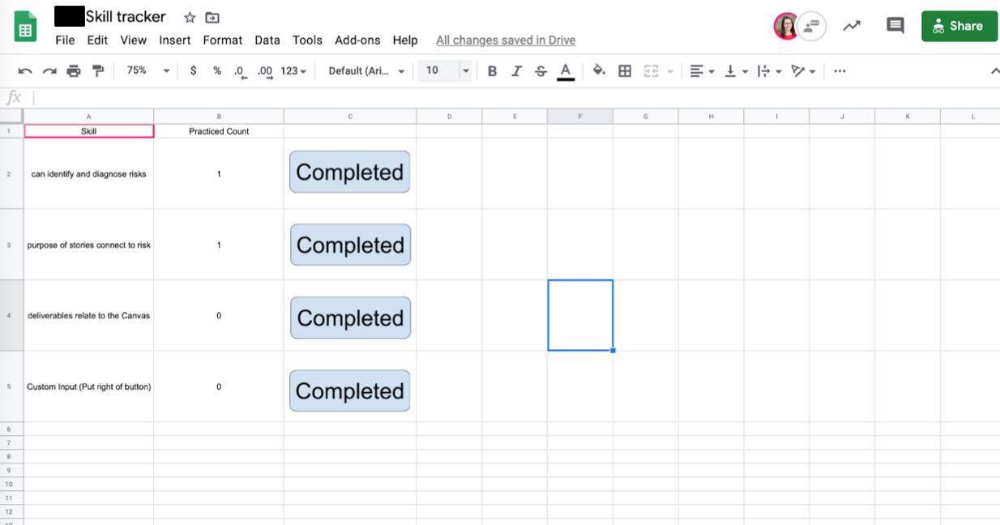

# regulation-devices

We've used Google App scripts to add custom functionality to Google sheets. Here are the spreadsheet templates:
* [Agenda](https://docs.google.com/spreadsheets/d/1UrbXyRgs_Jjb5BE9GTgNoXFkBNxZW-hnwRsEyFGWOhg/edit#gid=0)
* [Skill Tracker](https://docs.google.com/spreadsheets/d/1ZDLsA0coL29L69sve6d-dfmpgH4seyM6n8WMF1yx0Ag/edit#gid=0)

## Agenda
The agenda acts as the planning view of the canvas structured with the expert thinking model. The code here enables a pop-up side bar to help scaffold students through filling out the agenda.

## Skill Tracker
The skill tracker allows mentors to track which skills a student has used during SIG. Each "Completed" button is just a image, that when clicked, increases the skill account associated in that row.

## Usage
After installing the code, just import the relevant folder to which ever Google sheet you are working on. You will need to give permission to run the script. It will automatically ask when you first try to run it.
